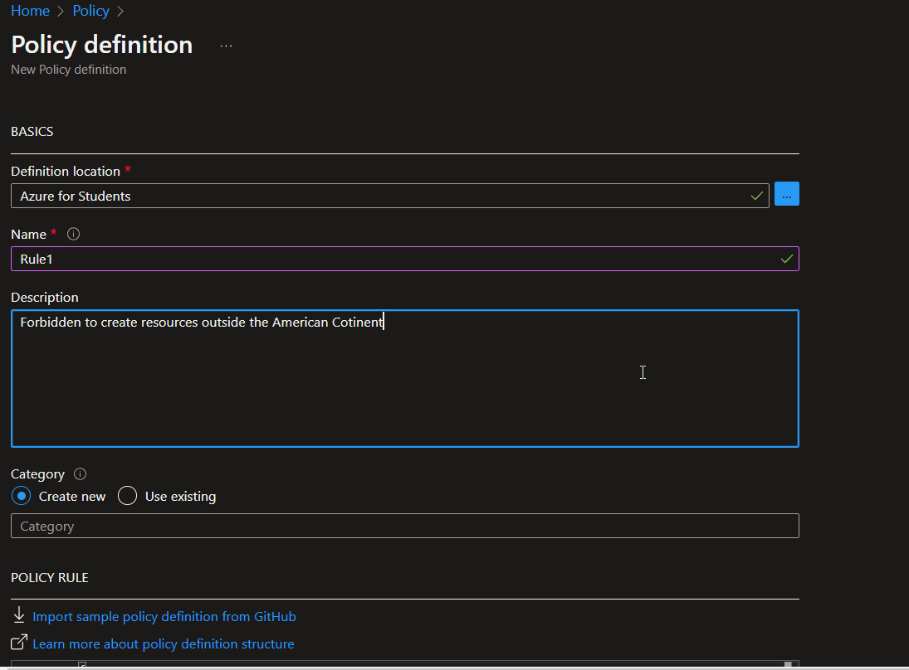

# Practice Azure Policy

----------------------------------------------------------------
## Process:
##### -We login in [Azure](https://www.portal.azure.com)
##### -Azure Policy allows us to crate rules to manage the cloud.
##### -Create a resource group.

##### -Set a name, click on review and create.

##### -Now, we look for policy and click on it.

##### -We have Events section, where you can see wich rule is met and wich is not.

##### -Now, we have Remediations, where we can see the errors and correct them.

##### -In definitions section, we have policy definition, and initiative definition, the first is a rule, and the second is a set of rules.

#### -We go to create a new rule... click on policy definition.

##### -In definition location cliclk on launch scope selector... 

##### -Choose your subscription and click on select.

##### -Set a name, and you have to describe your rule.

##### -Click on save.

##### -You can assign the rule.

##### -You can select the resource group.

##### -Or you can make exceptions.

##### -We have to assign policy.
##### -Go to Assignments section.
##### -Click on Assign policy.

##### -Click on scope.
##### -Select your resource group.

##### -Click on policy definition.

##### -Search policy definition, in this case, allowed location, click on it.

##### -Select Parameters section, we have to choose the allowed location.

##### -Now, you have to select all the allowed locations.

##### -If you want, you can set a non-compilance message, in the Non-compilance messages section.

##### -Then click on review and create.

##### -To see if this work, lets to create an App Function.
#### -Search App Function.

##### -Click on create.

##### -Select a resource group created.
##### -Set a name.
### -Is very important select a regin outside the American Country.

##### -Click on review and create.
##### -You should see a error, click on the error.

##### -You can see the message..

## 🔥🔥Congratulations..! You created an Azure Policy🔥🔥